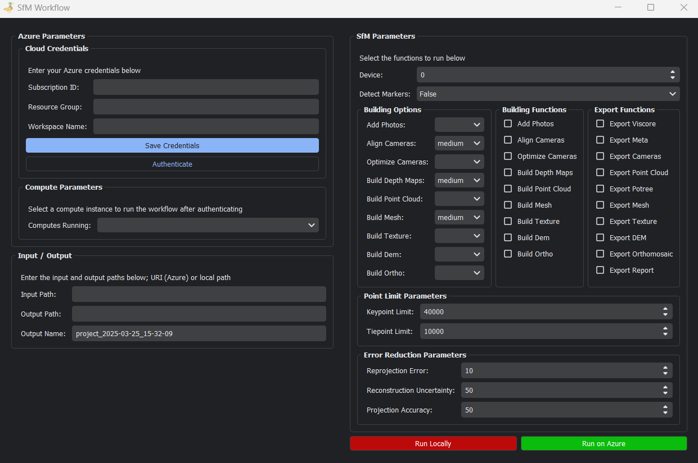

# Metashape Azure

### Installing 

```bash
# cmd

conda create --name sfm python=3.8 -y
conda activate sfm

pip install "git+https://github.com/Jordan-Pierce/Metashape-Azure.git"
```

If you are also running Metashape `locally`, you will need to run the `install.py` script as well:

```bash
# cmd

python install.py
```

This will add dependencies to the `Metashape` python environment. Finally, to run the application, use the following 
command:

```bash
# cmd

metashape-azure-mls
```

### Updating

```bash
# cmd

conda activate sfm

pip install -U "git+https://github.com/Jordan-Pierce/Metashape-Azure.git"
```

### Running the Application

<p align="center">
  
</p>

1. Open [Azure Machine Learning Studio](https://ml.azure.com/) in Microsoft Edge and login
2. Navigate to your workspace
3. Copy the following credentials from the top-right of the page:
    - Subscription ID
    - Resource Group
    - Workspace Name
4. Enter credentials in the application:
    - Use "Save Credentials" to store for future use
    - Click "Authenticate"
5. Select your compute cluster from the dropdown
6. Configure project paths:
    - Input Path: Azure URI to image folder
    - Output Path: Azure URI for project destination
    - Project Name: Unique name for your project
      > Note: `{output path}/{project name}` must not already exist
7. Select desired SfM parameters
8. Click "Run on Azure" to start processing

### Notes

- Azure Machine Learning Studio and Authentication must be done in `Microsoft Edge`
- You must be connected to the network (i.e., `VPN`) to access the `Azure` services.

